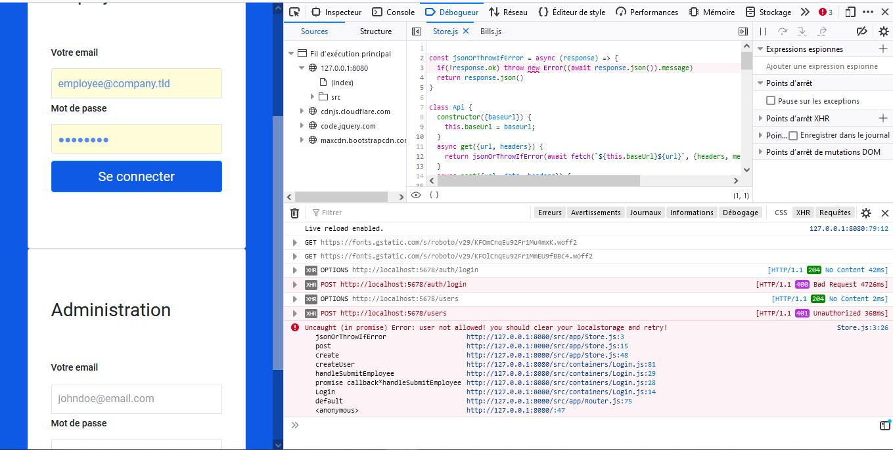
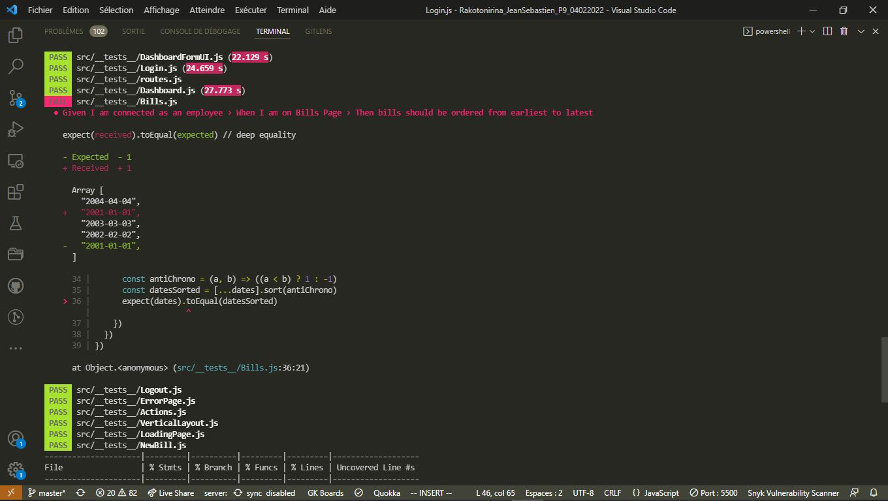
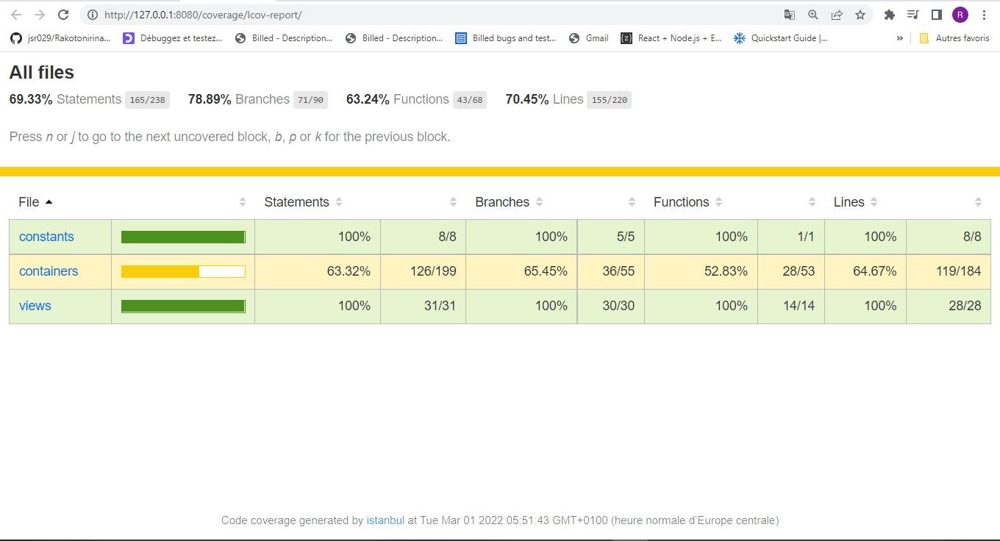
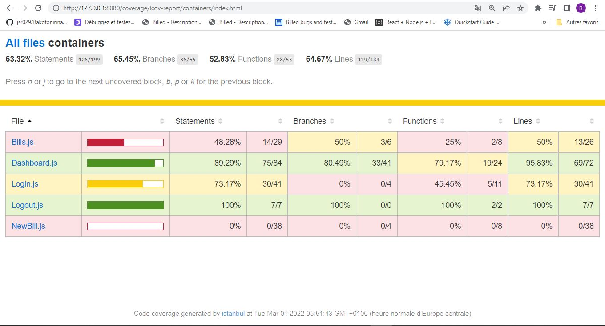

## Premier réflexe : erreur dans la console

   

Après enquête, 2 lignes causaient le bug qui empéchait de se loguer :

     handleSubmitAdmin = e => {
       e.preventDefault()
       const user = {
         type: "Admin",
         /**Première Modif remplacer employee par admin */
         email: e.target.querySelector(`input[data-testid="employee-email-input"]`).value,
         password: e.target.querySelector(`input[data-testid="employee-password-input"]`).value,
         status: "connected"
       }

## Autre moyen de rechercher les bugs : le Test par Jest (taper npm run test dans le repertoire frontend)

  

On peut de suite constater des erreurs dans l'expression de expect et du matcher. Sachant qu'il s'agit d'un order, toBeEqual n'est pas adéquat, on s'attendrait plus à un toBeLessThan ou toBeMoreThan. Mais toBeTruthy, c'est encore mieux. 

L'expression 
                            
                            expect(dates).toEqual(datesSorted) 
                            
devient 
                            
                            expect(datesSorted).toBeTruthy()

## Coverage : http://127.0.0.1:8080/coverage/lcov-report/
                           

   
   

 3 fichiers (Bills.js,Login.js et NewBill.js) nécessitent des investigations aussi bien dans le répertoire __containers__ que dans __tests__. Vérifier leur intégrité, la syntaxe, les exportations/importations, etc...

Il s'agit d'une première fois avec la structure React, et le framework Jest. Ce n'est pas évident, mais la curiosité est plus forte.
                                      
## Kanban : https://github.com/jsr029/Rakotonirina_JeanSebastien_9_04022022/blob/master/Bill-app/Billed-app-FR-Back/README.md
