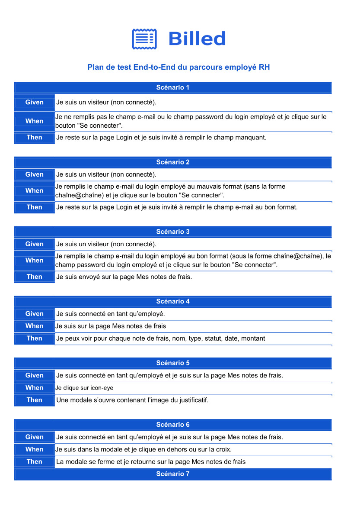

# Rakotonirina_JeanSebastien_9_04022022
Développeur React/Js 

## OpenClassrooms P9 : Débugger et tester un SaaS RH
- Ecrire des tests unitaires avec JavaScript
- Débugger une application web avec le Chrome Debugger
- Rédiger un plan de test end-to-end manuel
- Ecrire des tests d'intégration avec JavaScript

## Ecrire des tests unitaires avec Javascript

déf: Le test unitaire est le processus de test du code implémenté au niveau d'une application. Les tests unitaires permettent d'assurer que les applications développées répondent aux exigences spécifiées par le document commercial. Ces tests sont écrits pour chaque application au fur et à mesure de leur création.

Exemple :

    //Suite, 2 arguments : string et function callback
    describe("Player", function() {
    var player;
    var song;
      beforeEach(function() {
        player = new Player();
        song = new Song();
      });
      //Spécification, 2 arguments et function callback
      it("should be able to play a Song", function() {
        player.play(song);
        expect(player.currentlyPlayingSong).toEqual(song);
        //demonstrates use of custom matcher
        //Expectation, un argument ; accompagné d'un matcher ici toBePlaying
        expect(player).toBePlaying(song);
    });
  
  Extrait de tuto Jasmine.
  
  On peut avoir plusieurs suites (describe) les unes dans les autres et/ou les unes après les autres, contenant une ou plusieurs spécifications (it ou test) pour finir avec une expectation (expect) suivi d'un matcher toBe...
  
  ## Débugger une application web avec le Chrome Debugger
  
  Dans vscode, le débogueur est une extension et quand on clique sur l'icone dans la colonne de gauche, un bouton apparait "Exécuter et Déboguer". En cliquant dessus et en choisissant chrome comme browser, vscode génère un fichier launch.json et crée un bouton "launch Chrome against localhost". Une "console" de fonctionnalités apparait, on peut avancer ou reculer jusqu'à un arrêt prédéfini ou non. Cet outil peut aussi bien être utilisé dans Chrome, le résultat sera le même.
  
## Rédiger un plan de test end-to-end manuel

    

## Ecrire des tests d'intégration avec JavaScript

        /**
         * @jest-environment jsdom
         */

        import {screen, waitFor} from "@testing-library/dom"
        import BillsUI from "../views/BillsUI.js"
        import { bills } from "../fixtures/bills.js"
        import { ROUTES_PATH} from "../constants/routes.js";
        import {localStorageMock} from "../__mocks__/localStorage.js";

        import router from "../app/Router.js";
        import Bills from '../containers/Bills.js'

        describe("Given I am connected as an employee", () => {
          describe("When I am on Bills Page", () => {
            test("Then bill icon in vertical layout should be highlighted", async () => {

              Object.defineProperty(window, 'localStorage', { value: localStorageMock })
              window.localStorage.setItem('user', JSON.stringify({
                type: 'Employee'
              }))
              const root = document.createElement("div")
              root.setAttribute("id", "root")
              document.body.append(root)
              router()
              window.onNavigate(ROUTES_PATH.Bills)
              await waitFor(() => screen.getByTestId('icon-window'))
              const windowIcon = screen.getByTestId('icon-window')
              //to-do write expect expression
              expect(windowIcon).toBeTruthy()

            })
            test("Then bills should be ordered from earliest to latest", () => {
              document.body.innerHTML = BillsUI({ data: bills })
              const dates = screen.getAllByText(/^(19|20)\d\d[- /.](0[1-9]|1[012])[- /.](0[1-9]|[12][0-9]|3[01])$/i).map(a => a.innerHTML)
              const antiChrono = (a, b) => ((a < b) ? 1 : -1)
              const datesSorted = [...dates].sort(antiChrono)
              expect(datesSorted).toBeTruthy()
            })
          })
        })

Dans certains cas, on écrit d'abord les tests avant de coder, même s'ils sont voués à échouer au début.

        describe("Given I am connected as an employee", () => {
          describe("When I am on Bills Page", () => {
            test("Then bill icon in vertical layout should be highlighted", async () => {
            ...
            expect(windowIcon).toBeTruthy()
            })
        })
        
  Traduction :
  
        Given I am connected as an employee, Etant donné que je suis connecté en tant qu'employé
        When I am on Bills Page, Quand je suis sur la page Mes notes de frais 
        Then bill icon in vertical layout should be hightlighted, alors l'icone de la note de frais devrait être en surbrillance
        expect(...).toBeTruthy(), attendu que cela soit vrai
        
## Projet 9 
cliquer ici : https://github.com/jsr029/Rakotonirina_JeanSebastien_9_04022022/blob/master/Bill-app/Billed-app-FR-Front/README.md
